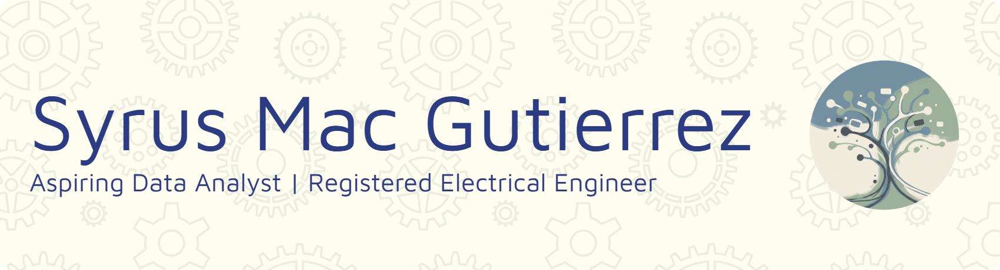

  

# Hi, I’m Syrus  

I’m transitioning into data analytics after completing the Eskwelabs Data Analytics Bootcamp, where I developed strong foundations in data cleaning, analysis, and visualization. I build hands-on projects to strengthen my skills and turn raw data into clear, actionable insights.

My goal is to become a full-time data analyst specializing in data cleaning, dashboarding, and turning messy data into clear insights.

---

## Featured Project
**PH Energy Dashboard (2003–2023)**  
Interactive Power BI dashboard analyzing long-term energy trends.  
[Repository](https://github.com/syrusgutierrez/ph-energy-dashboard) | [Live Dashboard](https://app.powerbi.com/view?r=eyJrIjoiODdjNDQwYTYtZTI0NS00ZmZhLWJkM2QtYTQ3ZmQ1YjFiZDM0IiwidCI6IjUyZGE4ZmY4LWZlZDktNDZjNC04YjlmLWI1ODU4OTJhMTQ0NiIsImMiOjEwfQ%3D%3D) | [Presentation Slides](https://docs.google.com/presentation/d/e/2PACX-1vSMuDTqxs-qmBe1THsObyC2muMvghiRe2vnaqgbT_44PpVm5BAyV1gwmN8jxNFwgYd0XbFXJM2zB5Ct/pub?start=false&loop=false&delayms=60000)

---

## Currently Learning
* Power BI (DAX, modeling)  
* SQL  
* Python for analytics  
* Data storytelling & visualization  

---

## Tools
Power BI • Tableau • Excel • SQL • Python (Pandas, NumPy, Matplotlib • DAX • Power Query • Git/GitHub 

---

## Connect
[LinkedIn](http://linkedin.com/in/syrusmacgutierrez) | syrus.mac19@gmail.com | [GitHub](https://github.com/syrusgutierrez)
